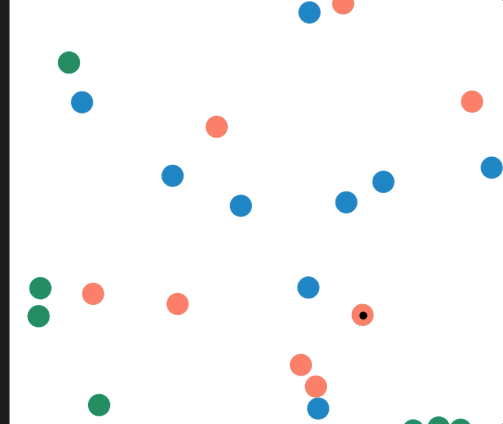

# 호혜적 이타주의 시뮬레이션

## 규칙

1. 새는 태어날 때 생명력이 100으로 시작한다.
2. 새는 매 프레임 마다 생명력이 1 증가한다
3. 생명력이 200이 초과하는 새는 번식한다. 번식한 새는 생명력이 100으로 초기화되고, 새로 태어난 새는 겹치지 않는 공간에서 시작한다.
4. 새는 매 프레임마다 랜덤한 확률로 (0.005%) 진드기가 생성된다.
5. 진드기가 생긴 새는 매 프레임 마다 생명력이 1 감소한다.
6. 새는 서로 붙이친 새에게 도움을 줄 수 있다. 붙이친 새가 진드기가 있다면 즉시 진드기를 제거해 준다. 도움을 준 새는 그 댓가로 30의 생명력을 차감한다.
7. 새의 종류는 아래 3가지이다.

● 도움주는 새 - 진드기가 생긴 새는 무조건 도와준다. 
● 배반하는 새 - 어떤 새도 도와주지 않는다. 
● 복수하는 새 - 진드기가 생긴 새를 도와준다. 단, 배반하는 새는 도와주지 않는다. 

## 관찰

도움주는 새만 있을 경우 - 서로가 서로를 도와주면서 개체수는 계속해서 증가한다.

배반하는 새만 있을 경우 - 진드기가 생기는 속도를 따라잡지 못하고 곧 전멸한다.

도움주는 새와 배반하는 새가 있을 경우 - 배반하는 새의 개체수는 늘고 도움주는 새의 개체수가 줄면서 종국에는 전멸한다.

도움주는 새, 배반하는새 그리고 복수하는 새가 있는 경우 - 배한하는 새의 개체수가 줄면서 도움주는 새와 복수하는 새가 남아서 개체 수를 증식한다.

